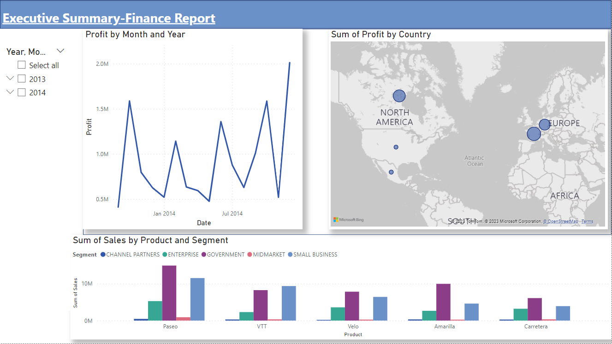

# Finance Report (Power BI)

An executive-summary finance report in Power BI, covering profit and sales by time, country, product and customer segment.

## What it shows

- Profit trend by month and year
- Profit by country on a map
- Sales by product and customer segment (Channel Partners, Enterprise, Government, Midmarket, Small Business)
- A year and month slicer to filter the whole report

## Report design

- A single executive-summary page
- Line chart for the profit trend, map for profit by country, clustered columns for product and segment
- Date hierarchy slicer and cross-filtering between visuals

## Files

| File | Description |
|---|---|
| `Finance Report Power Bi 1st Project.pbix` | Power BI report (open with Power BI Desktop) |
| `dashboard-preview.png` | Preview of the report |
| `finance report Dashboard.PNG` | Original full-screen capture |

## Tools

Power BI Desktop

## Author

**Omer Naeem Khan** — Data Analyst
[GitHub](https://github.com/OmerNaeemKhan) · [LinkedIn](https://www.linkedin.com/in/omer-khan-03833749)
